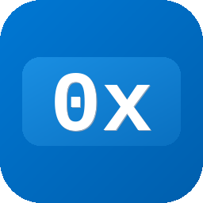

# BetterHexViewer.WinUI3

<p align="center">
  
</p>

<p align="center">
  <a href="https://www.nuget.org/packages/BetterHexViewer.WinUI3">
    
  </a>
  <a href="https://github.com/zipgenius/BetterHexViewer.WinUI3/actions/workflows/ci.yml">
    
  </a>
  <a href="LICENSE">
    
  </a>
</p>

> **BetterHexViewer.WinUI3** is a feature-rich, fully customisable hex-viewer
> control for Windows App SDK / WinUI 3 applications.  
> All rendering is GPU-accelerated via **Win2D** (`CanvasControl`) — a single
> `DrawingSession` replaces thousands of XAML elements, delivering smooth
> scrolling even at 4K resolution with tight column spacing.

---

## Features

| Feature | Detail |
|---|---|
| **GPU-accelerated rendering** | Win2D `CanvasControl` — one `DrawingSession` per frame, ~2 ms CPU time at 4K |
| **Large-file support** | Files of any size via `MemoryMappedFile` — no read limit, OS handles paging transparently |
| **Mouse selection** | Click-drag to select bytes; hex and ASCII panels stay in sync |
| **Hover cross-highlight** | 1 px border follows the pointer in both hex and ASCII panels simultaneously |
| **Context menu** | Right-click → copy selection as hex string or ASCII string |
| **Offset formats** | `Hexadecimal` · `Decimal` · `Octal` |
| **Column grouping** | 1 · 2 · 4 · 8 · 16 bytes per visual group |
| **Full-width auto-fit** | `FullWidth = true` adapts column count to available width |
| **Configurable spacing** | `BytesSpacing` (px between hex columns) · `ExtraLineGap` (px between rows) |
| **ASCII encoding** | `AsciiEncoding` property — Latin-1 (default), IBM CP437, UTF-8, CP1252, and any `System.Text.Encoding` |
| **ASCII panel** | Toggleable via `ShowAsciiPanel` |
| **Font control** | `FontFamily`, `FontSize`, `FontWeight` — all hot-reloadable at runtime |
| **Colour themes** | All brushes are bindable: `Background`, `Foreground`, `OffsetForeground`, `RulerForeground`, `SelectionBackground`, `SelectionForeground`, `DividerBrush` |
| **Tooltip** | 500 ms hover tooltip showing offset and byte value; correct positioning at any window location |
| **SelectionChanged event** | `StartOffset`, `Length`, `byte[]` copy of selected data (max 5 MB) |
| **ScrollToOffset** | Programmatically scroll to any byte offset |
| **LoadBytes** | Load a `byte[]` directly without a file |

---

## Requirements

| Component | Minimum version |
|---|---|
| Windows App SDK | 1.8 |
| Target OS | Windows 10 19041 (20H1) |
| Minimum OS | Windows 10 17763 (1809) |
| .NET | 8.0 |
| Win2D | `Microsoft.Graphics.Win2D` 1.3.0 |

---

## Quick start

### 1 – Add the NuGet package

```shell
dotnet add package BetterHexViewer.WinUI3
```

### 2 – Reference the namespace in XAML

```xml
xmlns:hex="using:BetterHexViewer.WinUI3"
```

### 3 – Drop the control on a page

```xml
<hex:BetterHexViewer
    x:Name="HexViewer"
    OffsetFormat="Hexadecimal"
    ColumnGroupSize="One"
    BytesSpacing="10"
    ExtraLineGap="4"
    FullWidth="False"
    ShowAsciiPanel="True"
    SelectionChanged="HexViewer_SelectionChanged"/>
```

### 4 – Load content

```csharp
// From a file path
await HexViewer.OpenFileAsync(filePath);

// From a byte array
HexViewer.LoadBytes(myByteArray);
```

### 5 – Change ASCII encoding

```csharp
using System.Text;

// Enable extended code pages (call once at app startup)
Encoding.RegisterProvider(CodePagesEncodingProvider.Instance);

// IBM CP437 (classic DOS)
HexViewer.AsciiEncoding = Encoding.GetEncoding(437);

// UTF-8
HexViewer.AsciiEncoding = Encoding.UTF8;
```

---

## Properties

### Layout & display

| Property | Type | Default | Description |
|---|---|---|---|
| `OffsetFormat` | `OffsetFormat` | `Hexadecimal` | Format of the offset column |
| `ColumnGroupSize` | `ColumnGroupSize` | `One` | Bytes per visual group |
| `BytesSpacing` | `double` | `10` | Horizontal gap between hex columns (px) |
| `ExtraLineGap` | `double` | `4` | Extra vertical gap between rows (0–12 px) |
| `FullWidth` | `bool` | `false` | Auto-fit columns to available width |
| `ShowAsciiPanel` | `bool` | `true` | Show or hide the ASCII panel |
| `AsciiEncoding` | `Encoding` | `Latin1` | Encoding used to decode bytes in the ASCII panel |
| `BytesPerLine` *(read-only)* | `int` | 16 | Current number of columns |
| `FileSize` *(read-only)* | `long` | 0 | Size of the loaded file in bytes |

### Font

| Property | Type | Default | Description |
|---|---|---|---|
| `FontFamily` | `FontFamily` | `Courier New` | Monospaced font family |
| `FontSize` | `double` | `13` | Font size in points |
| `FontWeight` | `FontWeight` | `Normal` | Font weight |

### Colours

| Property | Type | Default | Description |
|---|---|---|---|
| `Background` | `Brush` | Theme | Control background |
| `Foreground` | `Brush` | Theme | Hex and ASCII data text |
| `OffsetForeground` | `Brush` | Dark blue | Offset column text |
| `RulerForeground` | `Brush?` | `null` (auto) | Ruler header text; `null` = derived from background |
| `SelectionBackground` | `Brush` | Blue | Selection highlight background |
| `SelectionForeground` | `Brush` | White | Selected byte text |
| `DividerBrush` | `Brush` | Gray | Column divider lines |

---

## Methods

| Method | Description |
|---|---|
| `OpenFileAsync(string path)` | Async — loads a file from disk (max 1 MB buffered) |
| `LoadBytes(byte[] data)` | Loads raw bytes directly |
| `Clear()` | Clears the viewer |
| `CopySelectionAsHex()` | Copies selection to clipboard as space-separated hex pairs |
| `CopySelectionAsAscii()` | Copies selection to clipboard as ASCII text |
| `ScrollToOffset(long offset)` | Scrolls to the row containing the given byte offset |
| `Dispose()` | Releases the memory-mapped file handle opened by `OpenFileAsync` |

---

## Events

```csharp
HexViewer.SelectionChanged += (sender, e) =>
{
    // e.StartOffset : long   – first selected byte offset (-1 = no selection)
    // e.Length      : long   – number of selected bytes
    // e.Data        : byte[] – copy of up to 5 MB of selected bytes
};
```

---

## Enumerations

```csharp
public enum OffsetFormat    { Hexadecimal, Decimal, Octal }
public enum ColumnGroupSize { One = 1, Two = 2, Four = 4, Eight = 8, Sixteen = 16 }
```

---

## Building from source

```shell
git clone https://github.com/zipgenius/BetterHexViewer.WinUI3.git
cd BetterHexViewer.WinUI3
dotnet restore
dotnet build -c Release -p:Platform=x64
```

Run the demo application:

```shell
dotnet run --project src/BetterHexViewer.Demo -c Debug -p:Platform=x64
```

Create a NuGet package:

```shell
dotnet pack src/BetterHexViewer.WinUI3/BetterHexViewer.WinUI3.csproj \
    -c Release -p:Platform=x64 -o nupkg
```

---

## Changelog

See [CHANGELOG.md](CHANGELOG.md).

---

## License

MIT © zipgenius.it — see [LICENSE](LICENSE) for details.
